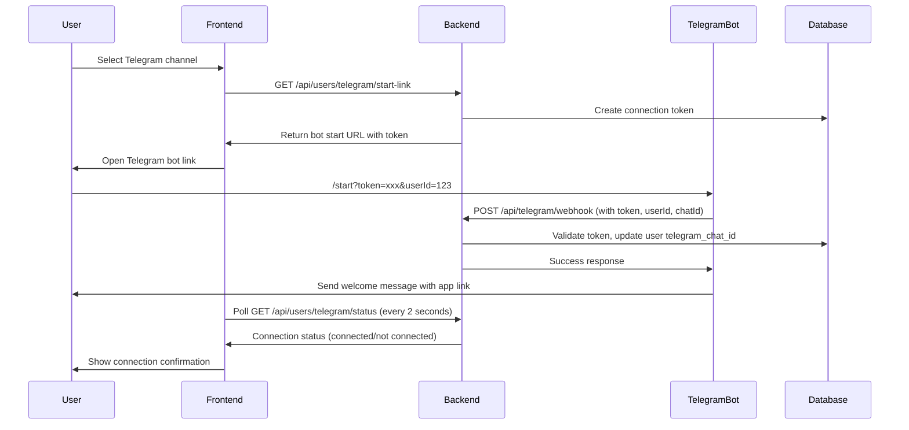

# Telegram Reminders Setup

This document describes how to configure Telegram reminders for Habitus.

## Overview

Habitus supports sending reminders via Telegram in addition to email. Users can configure their notification preferences through the Notifications modal in the application. The connection process uses a secure token-based flow for security.

## Prerequisites

1. A Telegram Bot Token from BotFather
2. A Telegram account for testing

## Backend Configuration

### Environment Variables

Add the following environment variable to your `.env` file:

```env
TELEGRAM_BOT_TOKEN=your_bot_token_here
```

### Getting a Telegram Bot Token

1. Open Telegram and search for `@BotFather`
2. Start a conversation and send `/newbot`
3. Follow the instructions to create a bot
4. Copy the bot token provided by BotFather
5. Add it to your `.env` file as `TELEGRAM_BOT_TOKEN`

### Setting Up the Webhook (Required)

**IMPORTANT:** The webhook must be configured for Telegram connections to work. Without a webhook, clicking "Start Bot" in Telegram will not trigger the connection process.

The webhook endpoint is: `POST /api/telegram/webhook`

#### For Production Environments (Railway)

**Automatic Setup (Recommended):**
The webhook is automatically configured when the server starts in production, using the `VITE_SERVER_URL` environment variable. Ensure:

1. `VITE_SERVER_URL` is set to your production URL (e.g., `https://habitus.nextstepslab.com`)
2. `TELEGRAM_BOT_TOKEN` is set in your Railway environment variables
3. The server will automatically set the webhook on startup

**Manual Setup (If automatic setup fails):**
If automatic setup fails, you can set it manually:

1. Ensure your server URL is publicly accessible (HTTPS required)
2. Set up the webhook by calling the setup endpoint:
   ```bash
   curl -X POST https://your-server.com/api/telegram/set-webhook \
     -H "Content-Type: application/json" \
     -d '{"webhookUrl": "https://your-server.com"}'
   ```
3. Verify the webhook is set up:
   ```bash
   curl https://your-server.com/api/telegram/webhook-info
   ```

## User Configuration Flow

The Telegram connection uses a secure token-based flow:

### Step 1: Select Telegram Channel

1. Open the Notifications modal in the Habitus application
2. Select "Telegram" as your notification channel (if not already connected, this opens the connection modal)

### Step 2: Connect Your Telegram Account

A connection modal will appear with two steps:

**Step 2a: Copy Your Key**

1. Click the "Copy key" button
2. A secure connection command is copied to your clipboard (you won't see the actual command text)

**Step 2b: Go to Telegram Chat**

1. Click the "Go to chat" button (enabled after copying the key)
2. This opens the Telegram bot chat in a new tab
3. Paste the copied command in the Telegram chat and send it
4. The modal will show a "waiting" view while checking for connection

### Step 3: Connection Confirmation

1. After pasting the command in Telegram, your account will be automatically connected
2. The bot will send you a welcome message confirming the connection
3. The connection modal will close automatically
4. The Notifications modal will show "Connected" status with your Telegram username
5. Your reminders will now be sent via Telegram

### Connection Token System

- Connection tokens are generated securely and expire after 10 minutes
- Each token is single-use and tied to a specific user
- Tokens are automatically cleaned up after expiration
- The connection command format is: `/start <token> <userId>`

## Telegram Account Connection Process

### Overview

The system uses a token-based connection flow: the frontend generates a connection token, the user sends it to the Telegram bot, and the backend validates it to complete the connection.

### Step-by-Step Connection Flow

#### 1. User Initiates Connection

- User opens Notifications Modal
- User selects Telegram channel (when not connected)
- `NotificationsModal` opens `TelegramConnectionStepsModal`

#### 2. Token Generation

- Frontend calls `GET /api/users/telegram/start-link`
- Backend (`TelegramConnectionService.generateConnectionToken`):
  - Generates a secure random token
  - Stores it in `telegram_connection_tokens` table with:
    - `user_id` (authenticated user)
    - `token` (random string)
    - `expires_at` (10 minutes from creation)
  - Returns: `{ link: string, token: string, userId: number }`

#### 3. Connection Modal Steps

`TelegramConnectionStepsModal` displays two steps:

**Step 1: Copy Key**

- The start command (`/start <token> <userId>`) is generated and stored internally
- User sees a "Copy key" button (the command text is not displayed)
- Clicking the button copies the command to clipboard
- Button becomes disabled after copying
- The user never sees the actual command text in the UI (for security)

**Step 2: Go to Chat**

- "Go to chat" button is enabled after Step 1 is completed
- Opens Telegram bot link in a new tab
- Modal switches to "waiting" view
- Starts polling status every 2 seconds

#### 4. User Completes Connection in Telegram

- User pastes `/start <token> <userId>` command in Telegram chat
- Telegram sends webhook to `POST /api/telegram/webhook`

#### 5. Backend Webhook Processing

`processTelegramUpdate` function:

- Validates `/start` command format
- Extracts `token` and `userId` from message
- Validates token via `TelegramConnectionService.validateToken`:
  - Checks if token exists
  - Checks if token is expired (10 minutes)
  - Verifies `userId` matches token's user
  - Deletes token (single-use)
- Updates user:
  - Sets `telegram_chat_id` from Telegram chat ID
  - Sets `notification_channels` to "Telegram"
- Sends welcome message via Telegram Bot API

#### 6. Frontend Status Detection

- Polling (every 2 seconds) detects connection
- `checkTelegramStatus` calls `GET /api/users/telegram/status`
- Backend returns:
  ```typescript
  {
    connected: true,
    telegramChatId: string,
    telegramUsername: string,
    hasActiveToken: false
  }
  ```

#### 7. Auto-Save and UI Update

- `NotificationsModal` detects connection:
  - Updates state: `telegramConnected = true`
  - Sets `telegramChatId` and `telegramUsername`
  - Auto-selects Telegram channel
  - Calls `savePreferences('Telegram', telegramChatId)`
  - Shows success message: "Telegram connected successfully as @username!"
  - Closes connection modal automatically

### Connection States

- **Not Connected**: `telegram_chat_id` is empty/null
- **Connecting**: Active token exists (`hasActiveToken: true`) but not connected yet
- **Connected**: `telegram_chat_id` is set and valid

### Error Handling

- **Token expiration**: Tokens expire after 10 minutes
- **Invalid token**: Token not found or already used
- **User ID mismatch**: Token belongs to different user
- **Webhook not configured**: Shows error in connection modal
- **Connection timeout**: User can cancel and retry

## Telegram Account Disconnection Process

### Overview

Disconnects the Telegram account, clears the chat ID, and switches notifications back to Email.

### Step-by-Step Disconnection Flow

#### 1. User Initiates Disconnection

- User clicks disconnect button (×) on Telegram badge in Notifications Modal
- Button appears when `telegramConnected === true`
- Located next to Telegram username badge

#### 2. Frontend Disconnect Handler

`handleDisconnectTelegram` function:

- Calls `onDisconnectTelegram()` (from `useAuth` hook)
- Updates UI state:
  - Sets `selectedChannel` to "Email"
  - Clears `telegramChatId` and `telegramUsername`
  - Sets `telegramConnected = false`
  - Resets success message flag

#### 3. API Call

- Frontend calls `DELETE /api/users/telegram`
- Requires authentication token in headers

#### 4. Backend Processing

`UserService.disconnectTelegram`:

- Loads user by ID
- Updates user record:
  - Sets `telegram_chat_id` to empty string `""`
  - Sets `notification_channels` to `"Email"`
- Returns updated user data

#### 5. UI Update

- Notifications Modal reflects changes:
  - Email channel is selected
  - Telegram badge shows "No account connected"
  - Disconnect button is hidden
- If error occurs, error message is displayed

### Important Notes

- **Automatic fallback**: If Telegram is selected but connection is lost, system automatically switches to Email
- **Single channel**: Only one notification channel can be active at a time
- **State synchronization**: Frontend checks status on modal open to detect expired tokens or lost connections

## How It Works

### Connection Flow



**Note:** The frontend uses polling (checking status every 2 seconds) to detect when the Telegram connection is complete. Polling continues while the connection modal is in the "waiting" state and stops automatically when the connection is detected or the modal is closed.

### Reminder Sending

- When a reminder becomes pending, the system checks the user's notification preferences
- If Telegram is selected and a chat ID is configured, a message is sent via the Telegram Bot API
- Only one notification channel can be selected at a time (Email OR Telegram)
- The message includes:
  - Reminder details (tracking question, scheduled time, notes)
  - Action buttons (Add Notes, Complete, Dismiss, Snooze)
  - Link to the dashboard

## API Endpoints

### User Endpoints

- `GET /api/telegram/start-link` - Generate a connection token and bot start link (requires authentication)
- `GET /api/telegram/status` - Check Telegram connection status (requires authentication)

### Webhook Management

- `POST /api/telegram/set-webhook` - Set up Telegram webhook URL (requires `webhookUrl` in request body)
- `GET /api/telegram/webhook-info` - Get current webhook information from Telegram

### Telegram Webhook

- `POST /api/telegram/webhook` - Handle Telegram bot webhook updates (used internally by Telegram)

## Troubleshooting

### Bot Token Errors

If you see errors about the bot token:

- Verify that `TELEGRAM_BOT_TOKEN` is set correctly in your `.env` file
- Ensure the token hasn't been revoked or regenerated
- Check that the token format is correct (no extra spaces or quotes)

### Connection Issues

If you're having trouble connecting:

- **Webhook not set up**: This is the most common issue. The webhook must be configured for Telegram to send updates to your server. Check webhook status:

  ```bash
  curl http://localhost:3005/api/telegram/webhook-info
  ```

  If the webhook URL is empty or incorrect, set it up using the instructions above.

- **Local development**: If testing locally, you must use a tunneling service like ngrok. Localhost URLs won't work because Telegram can't reach them.

- **Nothing happens when clicking "Start Bot"**: This usually means the webhook isn't set up. Check:

  1. Is the webhook configured? (use `/api/telegram/webhook-info`)
  2. Is your server accessible from the internet? (for production)
  3. Are you using HTTPS? (Telegram requires HTTPS for webhooks)
  4. Check server logs for webhook requests

- Make sure you've started a conversation with your bot first
- Verify that the connection link hasn't expired (tokens expire after 10 minutes)
- Try generating a new connection link

### Chat Not Found Errors

If you see "chat not found" errors:

- Make sure you've started a conversation with your bot first
- Verify that you clicked "Start" in the Telegram conversation
- Ensure the bot hasn't been blocked
- Try disconnecting and reconnecting your Telegram account

### Messages Not Received

If messages aren't being received:

- Check that Telegram is selected as your notification channel in the Notifications modal
- Verify that your Telegram account is connected (status should show "Connected")
- Ensure the bot is still active and hasn't been deleted
- Check your Telegram notification settings

### Connection Status Not Updating

If the connection status doesn't update after connecting:

- The frontend polls the connection status every 2 seconds when the connection modal is open. Wait up to 2 seconds for the status to update.
- If you closed the connection modal before the connection completed, reopening the Notifications modal will trigger a one-time status check to detect if the connection succeeded
- Check the browser console for any errors
- Verify that the webhook is working (check server logs)

## API Reference

The Telegram service uses the Telegram Bot API:

- Base URL: `https://api.telegram.org/bot{token}/`
- Send Message endpoint: `sendMessage`
- Get Chat endpoint: `getChat`
- Documentation: https://core.telegram.org/bots/api

## Security Notes

- Connection tokens are single-use and expire after 10 minutes
- Tokens are cryptographically secure and tied to specific user IDs
- The webhook endpoint validates tokens before updating user data
- All communication with Telegram's API uses HTTPS
