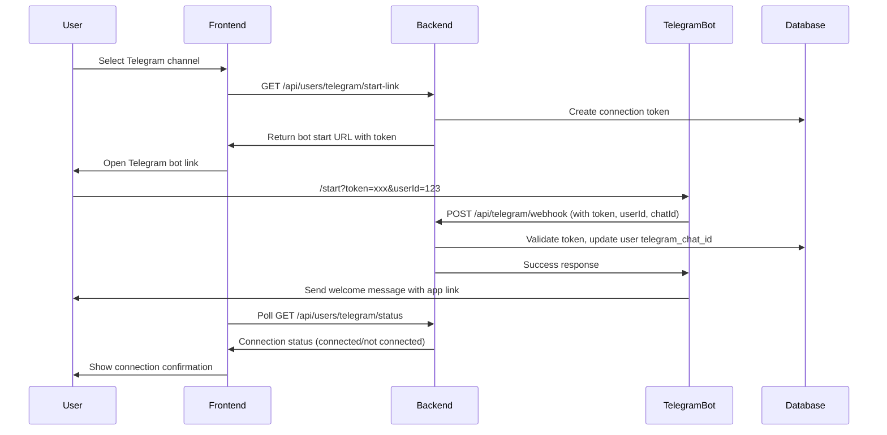

# Telegram Reminders Setup

This document describes how to configure Telegram reminders for Habitus.

## Overview

Habitus supports sending reminders via Telegram in addition to email. Users can configure their notification preferences through the Notifications modal in the application. The connection process uses a secure token-based flow for security.

## Prerequisites

1. A Telegram Bot Token from BotFather
2. A Telegram account for testing

## Backend Configuration

### Environment Variables

Add the following environment variable to your `.env` file:

```env
TELEGRAM_BOT_TOKEN=your_bot_token_here
```

### Getting a Telegram Bot Token

1. Open Telegram and search for `@BotFather`
2. Start a conversation and send `/newbot`
3. Follow the instructions to create a bot
4. Copy the bot token provided by BotFather
5. Add it to your `.env` file as `TELEGRAM_BOT_TOKEN`

### Setting Up the Webhook (Optional)

For production environments, you may want to set up a webhook for your Telegram bot:

1. Configure your server URL in the Telegram Bot API
2. The webhook endpoint is: `POST /api/telegram/webhook`
3. Telegram will send updates to this endpoint when users interact with your bot

**Note:** The webhook is automatically handled by the application. You only need to ensure your server URL is accessible to Telegram's servers.

## User Configuration Flow

The Telegram connection uses a secure token-based flow:

### Step 1: Select Telegram Channel

1. Open the Notifications modal in the Habitus application
2. Select "Telegram" as your notification channel

### Step 2: Connect Your Telegram Account

1. Click the "Connect Telegram" button
2. A secure connection link will be generated
3. The link will open in your default browser or Telegram app
4. Click "Start" in the Telegram conversation with the bot

### Step 3: Connection Confirmation

1. After clicking "Start" in Telegram, your account will be automatically connected
2. The bot will send you a welcome message confirming the connection
3. The Notifications modal will show "Connected" status
4. Your reminders will now be sent via Telegram

### Connection Token System

- Connection tokens are generated securely and expire after 10 minutes
- Each token is single-use and tied to a specific user
- Tokens are automatically cleaned up after expiration

## How It Works

### Connection Flow



### Reminder Sending

- When a reminder becomes pending, the system checks the user's notification preferences
- If Telegram is selected and a chat ID is configured, a message is sent via the Telegram Bot API
- Only one notification channel can be selected at a time (Email OR Telegram)
- The message includes:
  - Reminder details (tracking question, scheduled time, notes)
  - Action buttons (Add Notes, Complete, Dismiss, Snooze)
  - Link to the dashboard

## API Endpoints

### User Endpoints

- `GET /api/users/telegram/start-link` - Generate a connection token and bot start link
- `GET /api/users/telegram/status` - Check Telegram connection status

### Telegram Webhook

- `POST /api/telegram/webhook` - Handle Telegram bot webhook updates (used internally)

## Troubleshooting

### Bot Token Errors

If you see errors about the bot token:

- Verify that `TELEGRAM_BOT_TOKEN` is set correctly in your `.env` file
- Ensure the token hasn't been revoked or regenerated
- Check that the token format is correct (no extra spaces or quotes)

### Connection Issues

If you're having trouble connecting:

- Make sure you've started a conversation with your bot first
- Verify that the connection link hasn't expired (tokens expire after 10 minutes)
- Try generating a new connection link
- Check that your server can receive webhook requests from Telegram (for production)

### Chat Not Found Errors

If you see "chat not found" errors:

- Make sure you've started a conversation with your bot first
- Verify that you clicked "Start" in the Telegram conversation
- Ensure the bot hasn't been blocked
- Try disconnecting and reconnecting your Telegram account

### Messages Not Received

If messages aren't being received:

- Check that Telegram is selected as your notification channel in the Notifications modal
- Verify that your Telegram account is connected (status should show "Connected")
- Ensure the bot is still active and hasn't been deleted
- Check your Telegram notification settings

### Connection Status Not Updating

If the connection status doesn't update after connecting:

- Wait a few seconds for the status to sync
- Try refreshing the Notifications modal
- Check the browser console for any errors
- Verify that the webhook is working (check server logs)

## API Reference

The Telegram service uses the Telegram Bot API:

- Base URL: `https://api.telegram.org/bot{token}/`
- Send Message endpoint: `sendMessage`
- Get Chat endpoint: `getChat`
- Documentation: https://core.telegram.org/bots/api

## Security Notes

- Connection tokens are single-use and expire after 10 minutes
- Tokens are cryptographically secure and tied to specific user IDs
- The webhook endpoint validates tokens before updating user data
- All communication with Telegram's API uses HTTPS
